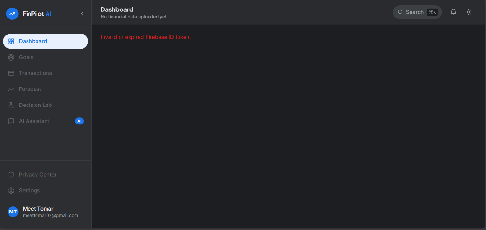
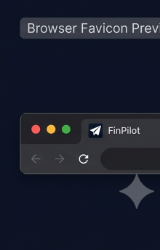
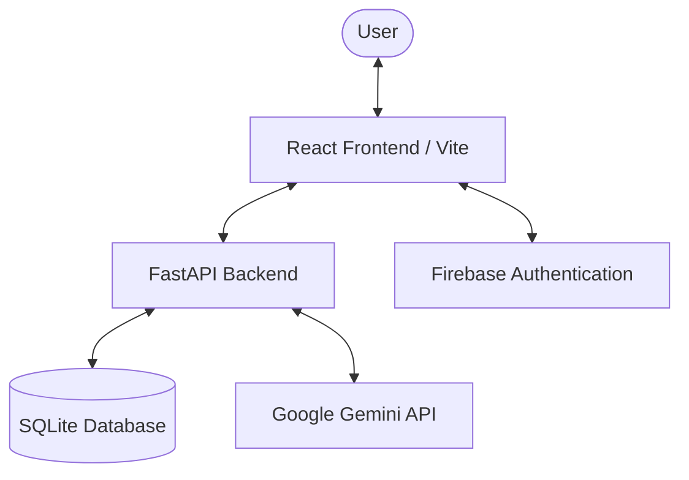

# FinPilot 🚀

AI-powered personal finance platform that transforms transaction data into actionable insights, forecasts, and smarter financial decisions using Google Gemini.

---

## 📺 Demo & Previews

### Dashboard Preview


### Interface Walkthrough
<div align="center">
  <table border="0" cellspacing="10" cellpadding="10">
    <tr>
      <td align="center" valign="top" width="50%">
        <strong>Sidebar Navigation</strong><br/><br/>
        
      </td>
      <td align="center" valign="top" width="50%">
        <strong>Preparing Workspace Loader</strong><br/><br/>
        
      </td>
    </tr>
    <tr>
      <td align="center" valign="top" width="50%">
        <strong>Navbar Header</strong><br/><br/>
        
      </td>
      <td align="center" valign="top" width="50%">
        <strong>High-Res Favicon</strong><br/><br/>
        
      </td>
    </tr>
  </table>
</div>

---

## ✨ Features

### 🧠 Context-Aware AI Assistant
* **Context-Driven Chat**: Discuss finances with a Gemini-powered sidebar that fully understands your transaction history, categories, and metrics.
* **Interactive AI Cards**: Recieve formatted summary cards directly in response bubbles (e.g., spending breakdowns, budget alerts).
* **Smart Onboarding**: Dynamic starter prompts guide you based on whether bank statements are uploaded.

### 📊 Financial Dashboard
* **Dynamic KPIs**: Real-time evaluation of Financial Health Score, Savings Rate, Cash Flow, and Emergency Fund Runway.
* **Human-Readable Metrics**: Status labels translated into plain-English supporting summaries (e.g., "Covers approx. 1.6 months of expenses").
* **Dynamic Date Ranges**: Automated date detection dynamically adapts components to your CSV transaction ranges.

### 🧪 Decision Lab & Simulations
* **Purchase Modeling**: Simulate major expenses (e.g., buying a car, house, tech) before you spend to see the impact on cash flow and goal timelines.
* **Side-by-Side Charts**: Visualizes simulated net worth and monthly cash flow changes using high-fidelity charts.
* **Safety Guards**: Prevents simulation run commands on empty or incomplete datasets.

### 🔒 Privacy & Data Portability
* **Privacy Center**: Audited status checklist verifying Firebase auth isolation, secure channels, and localized databases.
* **Data Portability**: Full data export features backing up records as raw CSVs or printable, branded PDF financial portfolios.

---

## 🛠️ Technology Stack

<p align="left">
  <a href="https://react.dev/"></a>
  <a href="https://www.typescriptlang.org/"></a>
  <a href="https://fastapi.tiangolo.com/"></a>
  <a href="https://firebase.google.com/"></a>
  <a href="https://sqlite.org/"></a>
  <a href="https://ai.google.dev/"></a>
  <a href="https://vite.dev/"></a>
  <a href="https://opensource.org/licenses/MIT"></a>
</p>

---

## 📐 Architecture



---

## 🚀 Running Locally

### 1. Prerequisite Checklist
* Node.js (v18+)
* Python 3.11
* Google Gemini API Key

### 2. Configure Environment Variables
Create a `.env` file inside the `backend/` directory:
```env
GEMINI_API_KEY=your_gemini_api_key_here
```

### 3. Automatic Setup & Installation
Initialize the virtual environment, install dependencies, and automatically apply SQLite migration DDLs:
```bash
npm run setup:backend
```

### 4. Run Development Stack
Start the FastAPI server (running on port `8000`) and the React Vite server (running on port `5173`) concurrently:
```bash
npm run dev:stack
```

---

## 📁 Repository Structure

```text
├── backend/
│   ├── app/
│   │   ├── models/       # SQLAlchemy models (transactions, goals, decisions)
│   │   ├── routers/      # FastAPI API routers (CRUD, Chat, Upload)
│   │   ├── schemas/      # Pydantic data validation schemas
│   │   ├── services/     # Gemini AI prompt orchestration
│   │   └── main.py       # Application startup & schema migrators
│   └── pyproject.toml    # Python packages & lock config
├── src/
│   ├── app/
│   │   ├── components/   # Custom inputs, modals & dropdown hooks
│   │   ├── api.ts        # Axios integrations & typings
│   │   └── screens.tsx   # Dashboard, Decision Lab, & History SPA screens
│   └── main.tsx          # React application entry point
├── public/
│   ├── screenshots/      # Walkthrough screenshots & graphics
│   └── favicon.ico       # Brand favicons
├── index.html            # Web application shell
└── package.json          # Node dev scripts & Tailwind config
```

---

## 🗺️ Future Roadmap

- [ ] **Universal CSV Import**: Standardized parser supporting format variants from global banks.
- [ ] **AI CSV Mapping**: Automated bank statement column mapper powered by LLM heuristics.
- [ ] **Recurring Transactions**: Automated detection of recurring subscriptions and cash outflows.
- [ ] **Interactive Budget Planner**: Dynamic envelope budgeting with progress triggers.
- [ ] **Smart Notification Center**: Contextual notifications for threshold crossings and burn rates.
- [ ] **Multi-bank Connections**: Secure account syncing via Plaid integration.

---

## 📄 License

Distributed under the MIT License. See [LICENSE](LICENSE) for more details.

---

## 👥 Contributors

* **Somnath Singh** — Fullstack & AI Integration Engineer
