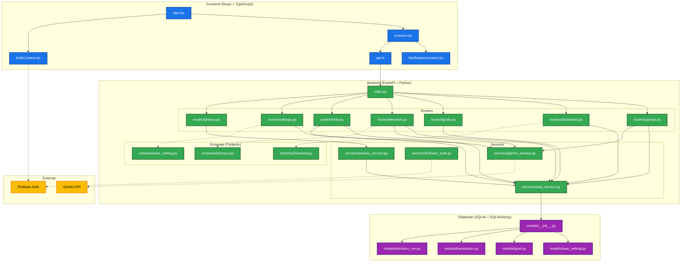

# FinPilot AI 🚀

FinPilot AI is a premium, production-grade AI-powered financial assistant and planning dashboard designed to help users take control of their financial future. It aggregates transaction history, models complex scenarios, and uses Google Gemini to deliver highly contextualized financial guidance.

Built for the **Advanced AI Hackathon**, FinPilot AI prioritizes visual excellence, data integrity, and strict user privacy.

---

## 🌟 Key Features

### 1. Interactive Financial Dashboard
* **Dynamic Analytics**: Computes real-time KPIs—including **Financial Health Score**, **Decision readiness**, **Savings Rate**, and **Emergency Fund Runway**—directly from uploaded transaction data.
* **Onboarding & Empty States**: Supports clean empty states (`--`) with a welcoming onboarding hero section for new accounts, preventing misleading placeholder math.
* **Dynamic Date Ranges**: Automatically extracts the latest transaction month/year to display custom date ranges dynamically.

### 2. Context-Aware AI Assistant
* **Google Gemini Integration**: An intelligent conversational sidebar that responds with full awareness of your current financial context.
* **Interactive Data Cards**: The assistant embeds formatted summary cards directly in response bubbles.
* **Smart Starter Prompts**: Dynamically changes suggested starter prompts based on whether transaction history is uploaded.

### 3. Decision Lab
* **Scenario Modeling**: Simulate high-impact purchases (e.g., buying a car, house, laptop, custom scenarios) to model cash flow effects and goal timeline delays.
* **Simulated Metrics**: Visualizes cash flow and net worth delta side-by-side using high-fidelity chart overlays.
* **Shield Protection**: Safeguards simulations by blocking run requests on empty datasets.

### 4. Real-time Notification Center
* **Event Logging**: Tracks uploads, goal updates, completed simulations, and data exports.
* **Smooth Micro-interactions**: Opens a popover menu directly beneath the notification bell with smooth scale and fade-in transitions, escaping and closing on outside clicks.

### 5. Transparency-focused Privacy Center
* **Honest Assertions**: Simple, audited status grid verifying *Firebase Authentication*, *Secure Connection*, *Data Export*, and *User Data Isolation*.
* **Data Exports**: Fully functional export pipeline generating raw CSVs or printable PDF financial portfolios.
* **Delete Account Lock**: Disabled button explicitly marked as unavailable to avoid false compliance claims.

### 6. Premium UI/UX & Dark Mode
* **Custom Dropdown Selects**: Native `<select>` elements are replaced by custom keyboard-accessible, dark-themed Select components.
* **Dynamic Animations**: Custom HSL color schemes, smooth layout transitions, and glassmorphic card overlays.

---

## 🛠️ Technology Stack

* **Frontend**: React, TypeScript, Vite, Tailwind CSS, Lucide Icons, Sonner.
* **Backend**: FastAPI (Python 3.11), SQLAlchemy, SQLite, Pydantic.
* **Authentication**: Firebase Client SDK & Firebase Admin SDK.
* **AI Model**: Google Gemini API (`gemini-2.5-flash`).

---

## 🚀 Running the Project

### One-Command Setup (Python 3.11 Locked)

Initialize the backend virtual environment, install local Python dependencies, and set up database migrations:

```bash
npm run setup:backend
```

### Start Development Stack

Run the backend server (on `127.0.0.1:8000`) and the Vite frontend (on `127.0.0.1:5173`) concurrently:

```bash
npm run dev:stack
```

*Note: Vite config is equipped with an API proxy, automatically forwarding all `/api/*` frontend calls to the backend.*

---

## 🗺️ Project Architecture



---

## 📁 Repository Structure

* `src/` — React/TypeScript frontend files.
* `backend/app/` — FastAPI backend applications (routers, schemas, services).
* `backend/app/models/` — SQLAlchemy database schemas (Transactions, Goals, Decisions, Settings).
* `backend/app/tests/` — Backend API integration test cases.
* `docs/` — Developer documentation and architectural diagrams.
